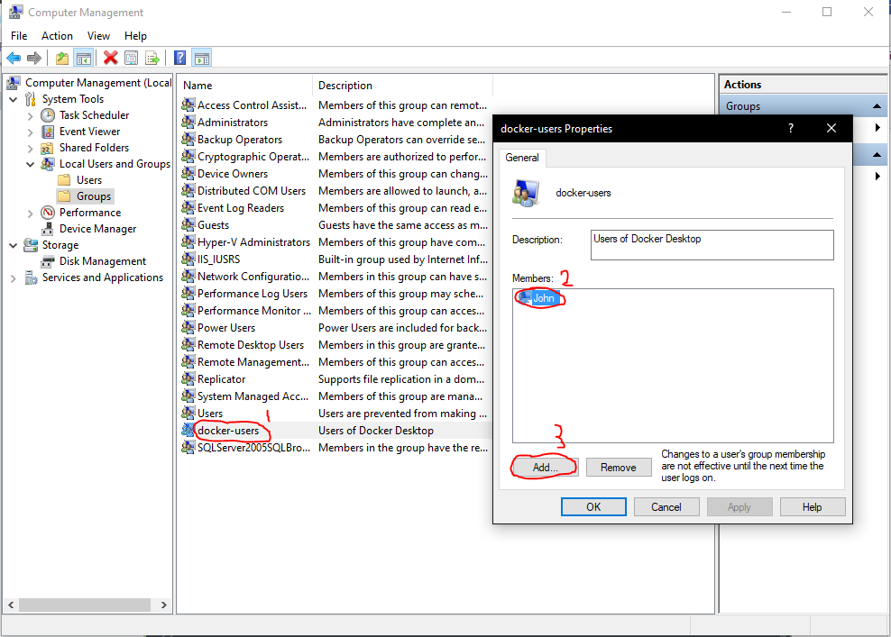

# Docker | Containerisation Tool

## Comparing Containers and Virtual Machines

#### Containers and virtual machines have similar resource isolation and allocation benefits, but function differently because containers virtualize the operation instead of hardware. Containers are more portable and efficient.


| **Containers**                                                                                                                                                                                                                                                                                                                                                                                                                                                | **Virtual Machines**                                                                                                                                                                                                                                                                                                                          |
|---------------------------------------------------------------------------------------------------------------------------------------------------------------------------------------------------------------------------------------------------------------------------------------------------------------------------------------------------------------------------------------------------------------------------------------------------------------|-----------------------------------------------------------------------------------------------------------------------------------------------------------------------------------------------------------------------------------------------------------------------------------------------------------------------------------------------|
| Containers are an abstraction at the _**app layer**_ that packages   code and dependencies together. Multiple containers can run on the   _**same machine**_ and share the OS kernely with other containers,   each running as isolated processes in user space. Containers take   up _**less space**_ than VMs (container images are typically tens of MBs in size),   can _**handle more applications**_ and require fewer VMs and _**Operating Systems**_. | Virtual Machines (VMs) are an abstraction of _**Physical hardware**_ turning one server into many servers.   The hypervisor allows multiple VMs to run on a single machine.   Each VM includes a _**full copy of an OS**_, the application,   necessary binaries and libraries - taking up tens of GBs.   VMs can also be _**slow to boot**_. |

# Docker Set up

### Step 1

First we need to install Docker: [**Windows**](https://download.docker.com/win/stable/Docker%20Desktop%20Installer.exe) | [**Mac**](https://download.docker.com/mac/stable/Docker.dmg) | [**Linux**](https://hub.docker.com/search?q=&type=edition&offering=community&operating_system=linux)

Once thats downloaded, simply run the .exe that is downloaded and follow the steps in the install wizard.

Please be aware that virtualization needs to be turned on for this to work if you are on Windows. To do that go into your **BIOS** and turn it on. The Install Wizard will ask you to turn on **Hyper-V** a feature only available for Windows 10 **Pro** | **Education** and **Community** editions.

_**Navigate to Computer Management and run as administrator**_


_**Double click the Groups folder**_


1. Double click `Docker users` 
2. Select your user in my case it was `John`
3. Click `Add`



1. After you have clicked `Add`
2. Type in your user; in my case `John`
3. Click `Check names` and then finally click
4. Click `Ok` and then exit out.


That is the first part of the docker set up, now **Restart your PC** and then open **Docker on launch**.

It should look like this.


_Minus the containers as that is what I have created_.

### Step 2

You can either follow the tutorial Docker provides and then do this or skip it and follow my tutorial below.

Now lets check if docker is running on our PC... open your `GitBash` in Administrator and you can run the following commands...

```bash
# print out list of docker commands ~ only works if it is installed
docker

# Check docker version too
docker --version
```

Now lets create a container! We are going to create a simple image that is running on **NGINX**. lets first pull the image from the official repo on [**Docker-Hub**](https://hub.docker.com/_/nginx)

```bash
# Pull NGINX image
docker pull nginx
```

___

#### Some useful commands:

```bash
# Check currently stored images on your docker
docker images

# Check your currently associated container
docker ps

# Check all currently created containers (-a = all)
docker ps -a

# pull images from Docker Hub
docker pull <image_name>

# Remove a container (-f = force removal)
docker rm <container_id/container_name> -f
```

___

Now we know about these commands lets initialise our container and then view it in our browser. When running the image we create it as a container, it is assigned an **ID** and random **name** that it can be referred to by. 

```bash
# Create a container using the NGINX image, on (-p = port) port 80 
# This is on our local machine and 80 in the web
docker run -p 80:80 <image_name>

# With NGINX
docker run -p 80:80 nginx
```

_**80:80**_ is mapping the ports for your container and means that when you go in your browser and go to [localhost:80](http://localhost:80) It should load the NGINX default home page. This can be done on any OS as it is not dependent on it; which is where dockers power really comes from.

_**The app in my browser**_


If you want to know how to create a repository on [**Docker Hub**] then follow the next step.

### Step 3

If you want to set up a Docker Hub Repository then follow these steps. In this case I am going to take the NGINX image and then change the tag and push it to my own repository.

_If you havent got a Docker Hub Account make [**one**](https://hub.docker.com)_

_**First Create a new Repository**_

1. Go to `Repositories`
2. Click `Create Repository`


_**Now give it a good name, make it public and create it**_


Once thats done, go back to your GitBash Terminal.

Lets then check our images to check if we have the NGINX image downloaded.

```bash
# List images stored on your docker
docker images
```


If you have NGINX then you are set, if not run the command `docker pull nginx`.

**Log in to your Docker**

```bash
# This logs you in and asks for your ID and password
docker login
```

Now lets rename it and then push it the repository we just made on our Docker Hub.

```bash
# Copy the image and rename it
docker tag <local_image> <newname_for_copy_of_image>

# In my case
docker tag nginx johnbyrnejames/john-eng67

# Push the new image you have created up to your Repo
docker images 
docker push johnbyrnejames/john-eng67
```

That is it you should now see the image on your Docker Hub if you go to the Repository...


Like GitHub this is a version control system and can facilitate the rollback, storage and distribution of an image. This image is now able to be pulled and run on your local machine.

```bash
# Pull your newly created image on your Repo <latest version>
docker pull johnbyrnejames/john-eng67:latest

# Now lets run a disposable container to check it (-it=interactable)
# (--rm=removal_on_exit)
docker run -it --rm -p 80:80 johnbyrnejames/john-eng67

# Once you exit with Ctrl+C lets run a detached instance of our image
# (-d=detached)
docker run -d -p 80:80 johnbyrnejames/john-eng67
```

The image under your name should now be available on port 80 of local host in your browser. You can also enter the container using a shell access command, this allows you to make changes the container.

```bash
# Set environment variable to use the winpty agent with docker
alias docker = "winpty docker"

# Now lets go into your container (-it = interactable)
docker exec -it <name_of_container/id_of_container> sh

# Get name of your container with 
docker ps -a
```

_This is where you can find your image identifiers: `name` or `id`_


So in my case

```bash
# Go into container with its name
docker exec -it competent_vaughan sh

# Go into container with its id
docker exec -it fff6e1212532 sh
```
